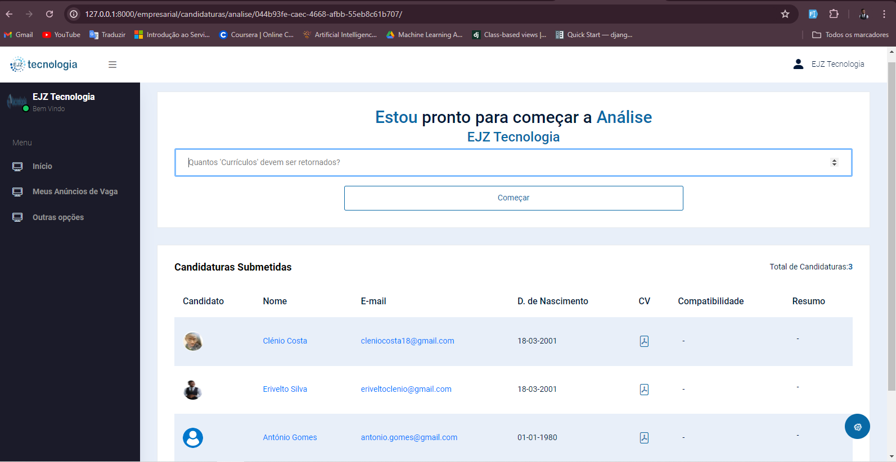
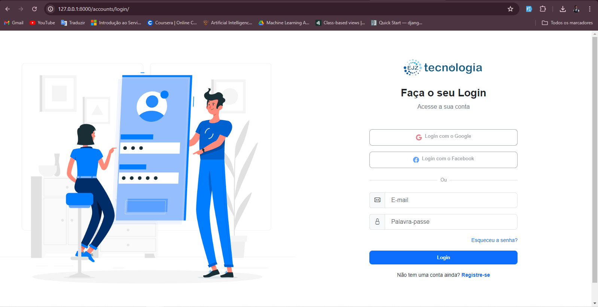
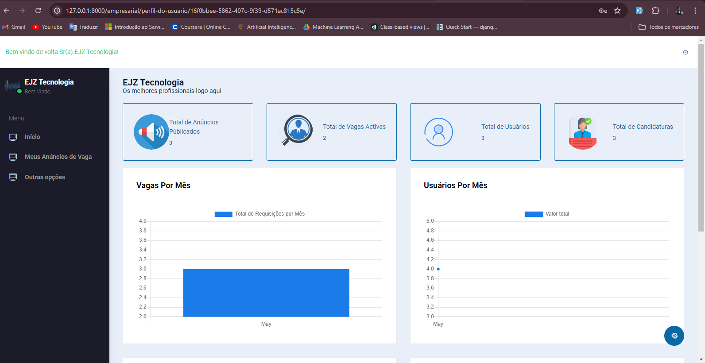
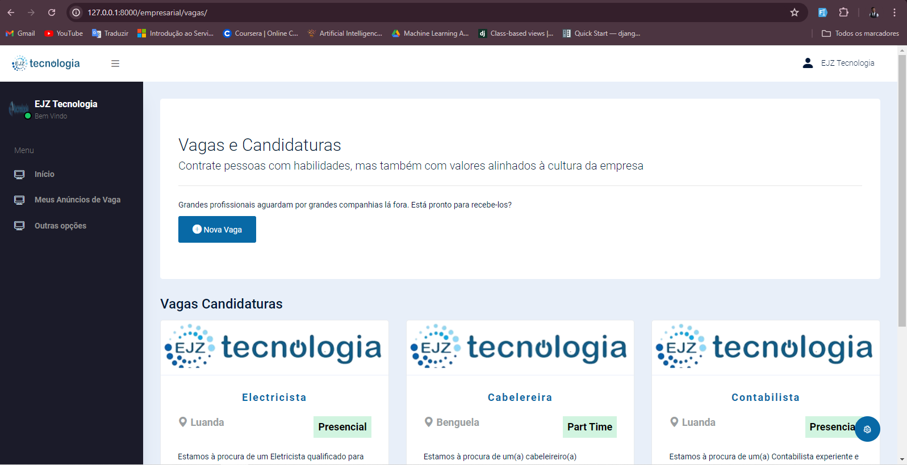
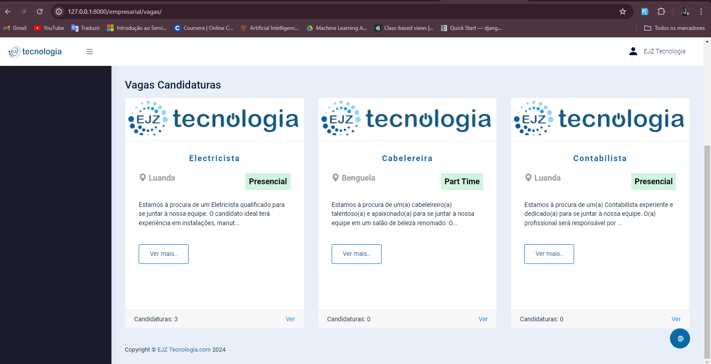
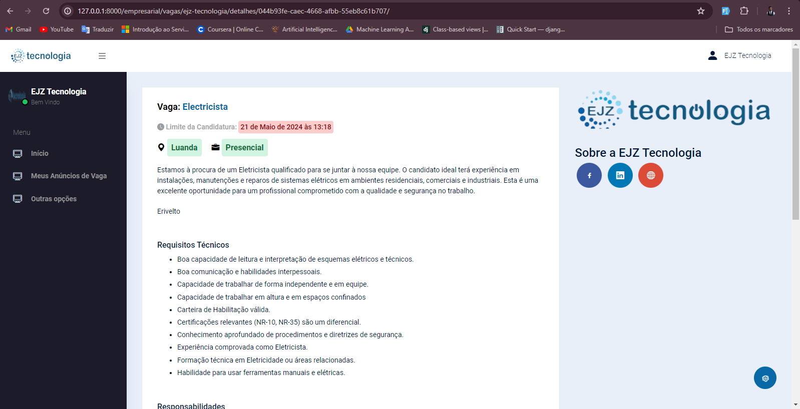
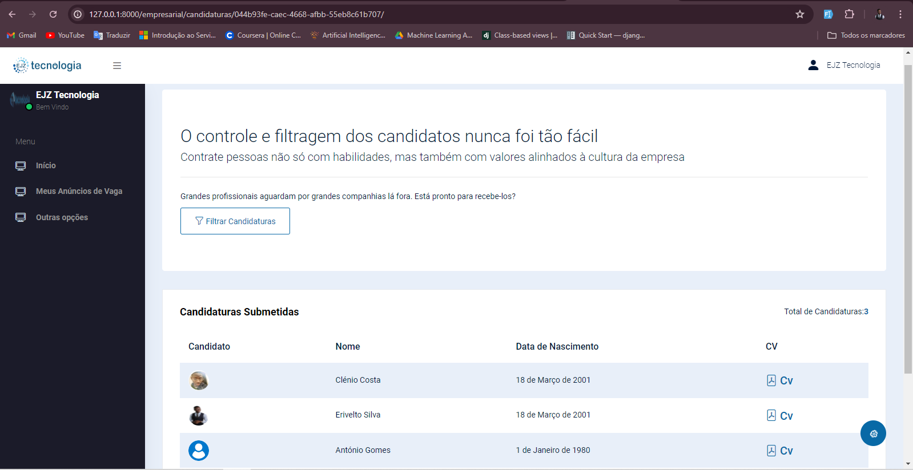
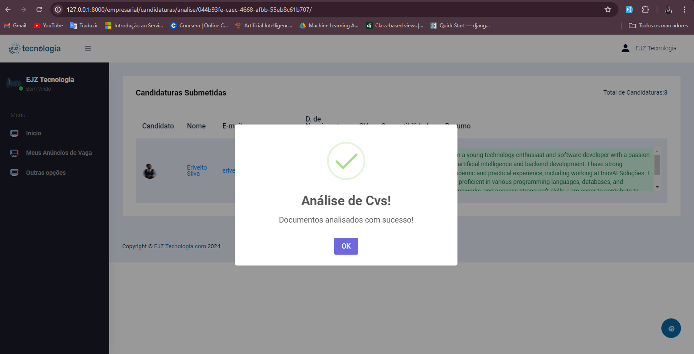
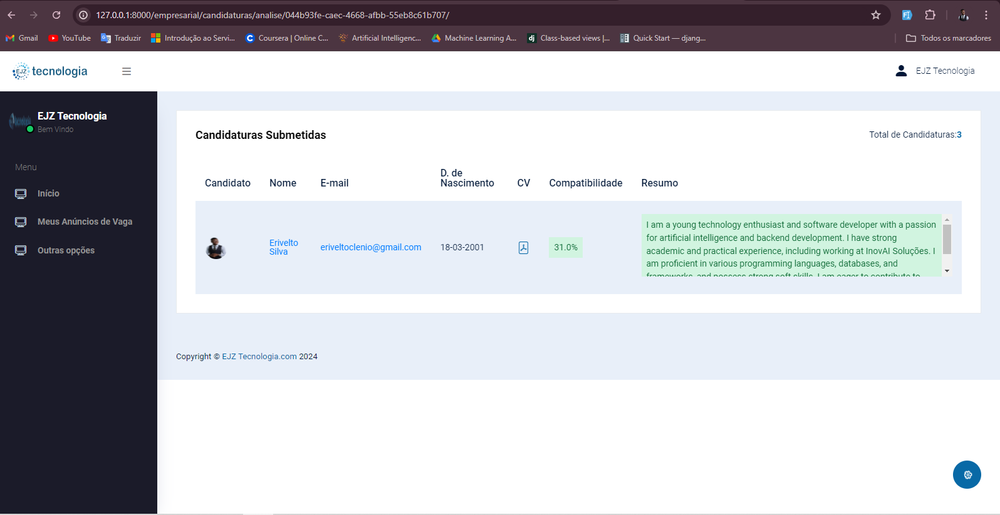

[MAINTENANCE_BADGE]: https://img.shields.io/badge/Maintained%3F-yes-green.svg
[PYTHON_BADGE]: https://img.shields.io/badge/python-3670A0?style=for-the-badge&logo=python&logoColor=ffdd54
[LICENSE_BADGE]: https://img.shields.io/pypi/l/ansicolortags.svg
[HTML5_BADGE]:https://img.shields.io/badge/html5-%23E34F26.svg?style=for-the-badge&logo=html5&logoColor=white
[CSS3_BADGE]:https://img.shields.io/badge/css3-%231572B6.svg?style=for-the-badge&logo=css3&logoColor=white
[JAVASCRIPT_BADGE]:https://img.shields.io/badge/javascript-%23323330.svg?style=for-the-badge&logo=javascript&logoColor=%23F7DF1E
[BOOTSTRAP_BADGE]:https://img.shields.io/badge/bootstrap-%238511FA.svg?style=for-the-badge&logo=bootstrap&logoColor=white
[DJANGO_BADGE]:https://img.shields.io/badge/django-%23092E20.svg?style=for-the-badge&logo=django&logoColor=white


<h1 align="center">EJZ Tecnologia Human Resources Assistant AI System</h1>

![HTML5][HTML5_BADGE]
![CSS3][CSS3_BADGE]
![JAVASCRIPT][JAVASCRIPT_BADGE]
![BOOTSTRAP][BOOTSTRAP_BADGE]
![DJANGO][DJANGO_BADGE]
![LICENSE][LICENSE_BADGE]

`Content:`

<ul>
    <li><a href="#about">About</a></li>
    <li><a href="#benefitsFeatured">Benefits Features</a></li>
    <li><a href="#gettingStarted">Getting Started</a></li>
    <li><a href="#howToRun">How To Run</a></li>
    <li><a href="#results">Results</a></li>
    <li><a href="#projectVideo">Project Video</a></li>
    <li><a href="#collaborators">Collaborators</a></li>
</ul>


<p align="center">
    
</p>

<h2 id="about">📌 About</h2>

This project is a job application management system developed to facilitate interaction between employers and candidates. The system allows employers to post job vacancies and manage applications, while candidates can search for and apply to job openings.

Additionally, this project features an AI-powered Human Resources Assistant that aids in the screening of CVs. Users can input a job description and specify the number of CVs they want to be returned. The system processes the CV data by converting the CVs text into Langchain Documents, creating embeddings and a vectorstore. It then screens the most relevant documents, providing a score indicating the percentage match between the provided job description and the CV data. This helps streamline the hiring process by quickly identifying the best-fit candidates.

<h2 id="benefitsFeatured">✔ Benefits Features</h2>

<h3> Employer Registration </h3>

- **Employer Sign-up**: Allows employers to register on the platform by providing information such as company name, contact details, and address.
- **Employer Verification**: Employers must be verified before they can post job vacancies.

<h3> Job Creation </h3>

- **New Job Postings**: Employers can create new job vacancies by adding details such as title, description, requirements, benefits, location, salary, and expiration date.
- **Job Editing**: Employers can review and edit the jobs they have created.

<h3> Job Posting </h3>

- **Review and Publication**: Job vacancies are published after review by an administrator or automatically after creation, depending on the configuration.
- **Job Visibility**: Published job vacancies are visible to registered candidates on the platform.

<h3> Candidate Registration</h3>

- **Candidate Sign-up**: Candidates can register on the platform by providing information such as name, contact details, work experience, skills, and education.

<h3> Job Search and Application </h3>

- **Job Search**: Candidates can search and filter job vacancies based on criteria such as location, job type, industry, salary, etc.
- **Job Viewing**: Candidates can view the details of job vacancies.
- **Job Application**: Candidates can submit their resumes for desired job vacancies and receive email confirmation of their application.

<h3> Application Management</h3>

- **Application Viewing**: Employers can view applications received for their job vacancies.
- **Application Management**: Employers can sort, filter, and manage received applications.
- **Candidate Communication**: Employers can contact candidates through the platform.

<h3> Notifications</h3>

- **Email Notifications**: Users receive email notifications about new job vacancies matching their profile, application status updates, and received messages.
- **Platform Notifications**: Notifications are also sent within the platform.

<h3> Reviews and Feedback </h3>

- **Feedback**: Employers and candidates can provide feedback on the recruitment process and on the candidates/employers.

<h3> Account Management </h3>

- **Profile Update**: Users can update their profile information and account settings.
- **Job Management**: Employers can manage their active job vacancies and application history.
- **Application History**: Candidates can access their application history and update their resumes.


<h2 id="gettingStarted">🚀 Getting Started</h2>

This section describes how to run the project locally.

<h3>Pre-requisites</h3>

Ensure you have the following libraries installed in your virtual environment:

<h4> Fundamental Libraries - General <h4>
<ul>
    <li>Django==5.0.3</li>
    <li>django-notifications-hq==1.8.3</li>
    <li>python-dotenv==1.0.1</li>
    <li>pillow==10.2.0</li>
    <li>daphne==4.1.0</li>
    <li>channels==4.0.0</li>
    <li>icalendar==5.0.11</li>
    <li>django-role-permissions</li>
    <li>django-debug-toolbar</li>
    <li>django-jazzmin==3.0.0</li>
</ul>

<h4> Core Libraries - Langchain </h4>
<ul>
    <li>chromadb==0.4.22</li>
    <li>firebase-admin==6.4.0</li>
    <li>langchain==0.1.8</li>
    <li>langchain-community==0.0.21</li>
    <li>langchain-core==0.1.24</li>
    <li>langchain-openai==0.0.6</li>
    <li>langchain-experimental==0.0.51</li>
    <li>openai==1.12.0</li>
    <li>pypdf==4.0.2</li>
    <li>PyPDF2==3.0.1</li>
    <li>python-dotenv==1.0.1</li>
    <li>tabulate==0.9.0</li>
    <li>tiktoken==0.6.0</li>
</ul>

<h4> Others </h4>

- OpenAI API Key


<h2 id="howToRun">🔗 How to Run</h2>

- Clone the project repository from GitHub:

```bash
git clone https://github.com/EriveltoSilva/HeadHunter.git
```

- Navigate to the project directory and install the virtual environment:

```bash
cd HeadHunter
virtualenv .venv
```

- Install the required dependencies:
```bash
pip install -r requirements.txt
```

- Copy the .env.example to .env:
```bash
cp .env.example .env
```
- Open .env file;
- Fill project SECRET_KEY;
- Fill EMAIL configs;
- Choose the right database config uncommenting that and db commenting others;
- Fill OPENAI_API_KEY;


<h2 id="results">🤝 Results</h2>

<p align="center">
    
</p>
<p align="center">
    
</p>
<p align="center">
    
</p>
<p align="center">
    
</p>
<p align="center">
    
</p>
<p align="center">
    
</p>
<p align="center">
    
</p>
<p align="center">
    
</p>
<p align="center">
    
</p>
<p align="center">
    
</p>


<h2 id="projectVideo">▶ Project Video</h2>

<a href="#">
See a short video of how project works on my ...
</a>

<h2 id="collaborators">🤝 Collaborators</h2>

Special thanks to the project contributor:

<table>
  <tr>
    <td align="center">
      <a href="#">
        <br>
        <sub>
          <b>Erivelto Silva</b>
        </sub>
      </a>
    </td>
  </tr>
</table>

<h2 id="contribute">📫 Contribute</h2>

To contribute to this project, follow these steps:

1. `git clone https://github.com/EriveltoSilva/human-resources-assistant-ai.git`
2. `git checkout -b feature/NAME`
3. Follow commit patterns
4. Open a Pull Request explaining the problem solved or feature made. If applicable, include screenshots of visual modifications and wait for the review!
